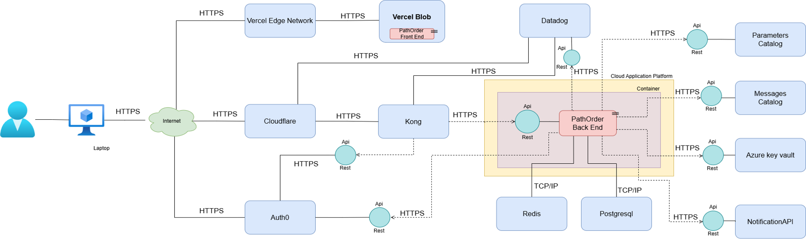
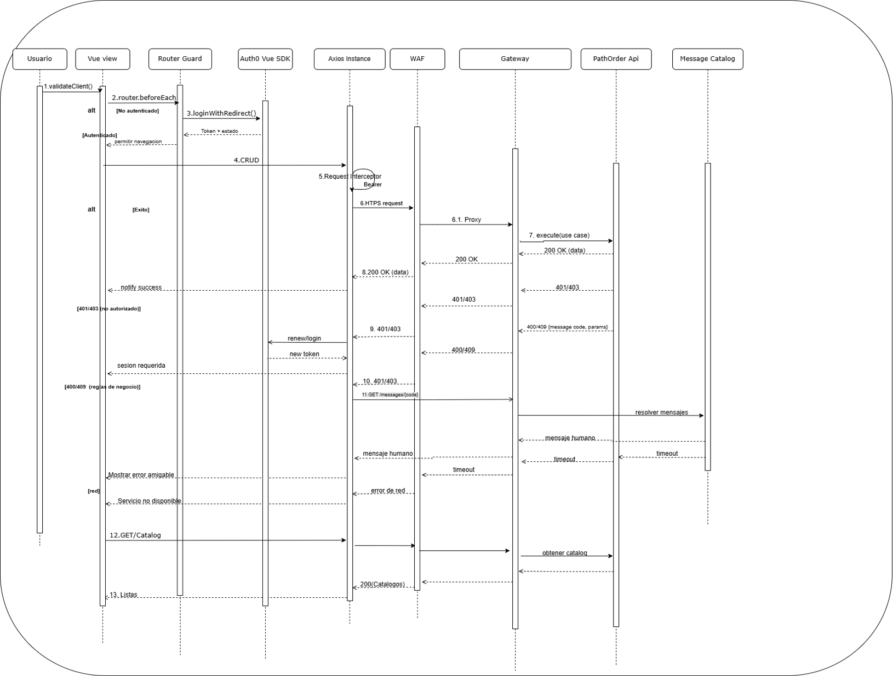

# **Documento de Arquitectura de Software**

## **PathOrder**

**Integrantes:**  
- Iván Daniel Naranjo  
- Jean Paul Ortiz Restrepo  

---

# **Introducción**

**PathOrder** es una plataforma web que permite **reservar y retirar pedidos** en restaurantes y cafeterías sin filas.  
La solución se diseña con enfoque **cloud-agnostic**, principios de **Clean Architecture** y **Arquitectura Hexagonal**, priorizando **seguridad**, **disponibilidad** y **escalabilidad**.

Este documento describe la arquitectura técnica de PathOrder desde cuatro vistas principales:

- **Despliegue:** componentes adoptados/desarrollados y su ubicación en la infraestructura.
- **Componentes:** módulos lógicos del backend y frontend y sus responsabilidades.
- **Paquetes:** organización interna bajo capas y dependencias controladas.
- **Secuencias:** flujos de interacción de casos de uso típicos (UI ↔ API ↔ servicios).

Además, se registran los **drivers arquitectónicos** (escenarios de calidad, restricciones y métricas de rendimiento) que guían decisiones clave a lo largo del ciclo de vida del proyecto.

---

# **1. Diagrama de Despliegue**

## **1.1 Descripción General**
El diagrama de despliegque representa la arquitectura física y lógica de PathOrder, mostrando los servicios adoptados y desarrollados, así como su interacción dentro del entorno cloud.  
La solución está diseñada bajo un enfoque **cloud-agnostic**, con algunos componentes contenedorizados, escalables y desplegados en servicios administrados, garantizando **alta disponibilidad**, **seguridad** y **eficiencia operativa**.

## **1.2 Componentes del Despliegue**

### **1.2.1 Componentes Principales**

| Componente | Tipo de Componente | Descripción | Justificación | ¿Es Bloque de Construcción? | Tipo de Bloque |
|-----------|-------------------|-------------|--------------|-----------------------------|----------------|
| **CDN** | Componente Adoptado | Entrega contenido estático del Frontend con baja latencia. | Aumenta el rendimiento y disponibilidad. | Sí | Genérico |
| **Blob Storage** | Componente Adoptado | Almacena imágenes y archivos asociados al catálogo y pedidos. | Evita sobrecargar el backend y facilita escalabilidad. | Sí | Genérico |
| **WAF** | Componente Adoptado | Filtra y bloquea tráfico malicioso (SQLi, XSS, CSRF). | Protege la infraestructura y datos. | Sí | Genérico |
| **Identity Management** | Componente Adoptado | Administración centralizada de autenticación y roles. | Garantiza seguridad en el acceso. | Sí | Genérico |
| **API Gateway** | Componente Adoptado | Punto de acceso unificado al backend. | Facilita enrutamiento y políticas de seguridad. | Sí | Genérico |
| **Monitoring Platform** | Componente Adoptado | Observabilidad y detección temprana de fallos. | Mantiene la estabilidad del servicio. | Sí | Genérico |
| **Database (PostgreSQL)** | Componente Adoptado | Persistencia de datos críticos del negocio. | Garantiza consistencia y disponibilidad. | Sí | Genérico |
| **Cache (Redis)** | Componente Adoptado | Almacenamiento temporal de lectura frecuente. | Reduce tiempos de respuesta y carga en BD. | Sí | Genérico |
| **Container Management** | Componente Adoptado | Despliegue y ejecución de servicios en contenedores. | Facilita portabilidad y escalado. | Sí | Genérico |
| **Parameters Catalog** | Desarrollo Propio | Configuración dinámica del sistema. | Permite ajustes sin redeploy. | Sí | Soporte |
| **Messages Catalog** | Desarrollo Propio | Gestión centralizada de mensajes del sistema. | Mejora mantenibilidad y soporte multiidioma. | Sí | Soporte |
| **Key Vault** | Componente Adoptado | Almacenamiento seguro de llaves y secretos. | Previene exposición de credenciales. | Sí | Genérico |
| **Notification Gateway** | Componente Adoptado | Envío centralizado de notificaciones. | Evita construir infraestructura propia. | Sí | Soporte |
| **PathOrder Back End** | Desarrollo Propio | Núcleo funcional del negocio. | Procesa operaciones críticas del sistema. | No | Core |
| **PathOrder Front End** | Desarrollo Propio | Interfaz de interacción con usuario final. | Facilita acceso y experiencia de usuario. | No | Core |

---

### **1.2.2 Bloques de Construcción Adoptados**

| Componente | ¿Es de Pago? | Fabricante | Producto | Versión | Protocolo | Justificación | Tipo de Bloque |
|-----------|--------------|------------|----------|---------|-----------|--------------|----------------|
| CDN | Sí | Vercel | Vercel Edge Network | Latest | HTTPS | Baja latencia global y optimización automática. | Genérico |
| Blob Storage | Sí | Vercel | Vercel Blob | Latest | HTTPS | Escalable e integrado con despliegue cloud. | Genérico |
| WAF | No | Cloudflare | Cloudflare WAF | Latest | HTTPS | Protección perimetral, DDoS mitigation y firewall inteligente. | Genérico |
| Identity Management | Sí | Auth0 | Auth0 IAM | Latest | HTTPS | Seguridad delegada y manejo de roles centralizado. | Genérico |
| API Gateway | No | Kong | Kong Gateway | 3.14 | HTTPS | Control, monitoreo y versionamiento de APIs sin licencias. | Genérico |
| Monitoring Platform | Sí | Datadog | Datadog APM | Latest | HTTPS | Trazabilidad y métricas avanzadas en tiempo real. | Genérico |
| Database | No | PostgreSQL | PostgreSQL | 14+ | TCP/IP | Motor maduro, confiable y libre de licencias. | Genérico |
| Cache | No | Redis | Redis | 8.2-M01 | TCP/IP | Mejora de rendimiento mediante acceso en memoria. | Genérico |
| Container Management | No | Render | Render Cloud | Latest | HTTPS | Despliegue automatizado y costo reducido. | Genérico |
| Key Vault | No | Azure | Azure Key Vault | Latest | HTTPS | Protección de secretos con auditoría y control de acceso. | Genérico |
| Notification Gateway | No | NotificationAPI | NotificationAPI | Latest | HTTPS | Comunicación confiable multicanal. | Soporte |

---

### **1.2.3 Bloques de Construcción Desarrollados**

| Componente | ¿Pago? | Tipo | Fabricante | Producto | Versión | Descripción | Justificación |
|-----------|--------|------|------------|----------|---------|-------------|---------------|
| Back End PathOrder | No | Lenguaje | OpenJDK | Java | 25 | Lenguaje base de la solución backend. | Versión LTS estable y optimizada. |
| Back End PathOrder | No | Framework | VMware | Spring Boot | 3.5.1 | Framework empresarial modular y escalable. | Facilita arquitectura limpia y mantenible. |
| IDE Backend | Sí | Entorno de Desarrollo | JetBrains | IntelliJ IDEA | 2024.3.3 | IDE para desarrollo profesional Java. | Aumenta productividad y calidad de código. |
| Asistente de Desarrollo | Sí | IA | Microsoft | GitHub Copilot | Latest | Soporte a desarrollo asistido. | Reduce tiempos y errores. |
| Base de Datos Serverless | No | DB Cloud | Neon | Neon Serverless PG | Latest | PostgreSQL serverless con escalado automático. | Optimiza costos en ambientes multi-etapa. |
| Front End PathOrder | No | Framework | Google | Angular | 19 | Framework UI moderno basado en TypeScript. | Soporta modularidad y escalabilidad UI. |
| IDE Frontend | No | IDE | Microsoft | Visual Studio Code | Latest | Editor extensible y estándar para web. | Ligero y versátil para desarrollo frontend. |
| CI/CD | No | Calidad | SonarQube | SonarQube | Latest | Inspección continua de seguridad y estilo. | Garantiza calidad en todo el ciclo. |

---

## **1.3 Imagen del Diagrama**

---

# **2. Diagrama de Componentes**

## **2.1 Descripción General**
El diagrama de componentes representa la estructura lógica de PathOrder, identificando los módulos que componen la solución tanto en el **Backend** como en el **Frontend**, así como sus dependencias internas y externas.  
Cada componente encapsula una responsabilidad específica, facilitando la mantenibilidad, extensibilidad y escalabilidad del sistema.

---

## **2.2 Componentes del Backend**

| Componente | Descripción | Motivación / Justificación | Depende / Usa | Tipo de Componente |
|-----------|-------------|----------------------------|---------------|-------------------|
| **PathOrder (Backend)** | Núcleo funcional que expone servicios REST para reservas, pedidos y administración. | Centraliza la lógica del dominio y permite la comunicación con el resto de servicios. | Spring Boot 3.7, Java 21, PostgreSQL, Redis, Key Vault, API Gateway | **Componente a Desarrollar (Core)** |
| **Spring Boot 3.7** | Framework para el desarrollo del backend. | Facilita configuración, modularidad y despliegue. | Java 21 | Framework / Acelerador |
| **Java 21** | Plataforma base del backend. | LTS, rendimiento y estabilidad. | - | Plataforma Base |
| **PostgreSQL JDBC + Spring Data JPA** | Manejo de persistencia mediante repositorios declarativos. | Reduce complejidad y estandariza el acceso a la BD. | PostgreSQL | Librería / Conector |
| **Spring Cache + Spring Data Redis** | Cache distribuida para datos consultados frecuentemente. | Mejora tiempos de respuesta y reduce carga de BD. | Redis Server | Framework / Acelerador |
| **Spring Security + OAuth2 Resource Server** | Control de autenticación y autorización basada en JWT. | Garantiza acceso seguro y controlado. | Auth0 (JWKs) | Framework / Acelerador |
| **spring-security-oauth2-jose** | Provee soporte criptográfico para la validación de tokens. | Garantiza autenticidad e integridad. | Spring Security | Librería |
| **Azure Key Vault Connector** | Obtención segura de secretos y credenciales. | Evita exposición de claves en código. | Azure Identity | Integración / Servicio Externo |
| **Spring Web / Spring WebFlux** | Exposición de APIs REST y comunicación reactiva. | Reduce latencia en integraciones externas concurrentes. | Reactor | Framework / Acelerador |
| **springdoc-openapi + Swagger UI** | Documentación automática de API y consola interactiva. | Facilita integración con otros equipos y clientes. | Spring Web | Framework / Acelerador |
| **Apache HttpClient** | Cliente HTTP para servicios externos. | Estabilidad y soporte amplio. | HTTP externo | Librería |
| **notificationapi-java-server-sdk** | Envío centralizado de notificaciones. | Evita desplegar infraestructura de mensajería propia. | HTTP externo | Servicio Externo |
| **MapStruct** | Generación automática de mapeos DTO ↔ Domain. | Reduce errores y mejora rendimiento. | Java 21 | Librería |
| **Actuator** | Exposición de métricas y endpoints de monitoreo. | Mejora observabilidad y soporte. | Spring Boot | Framework / Acelerador |
| **CrossCutting** | Funciones utilitarias reutilizables. | Fomenta la reutilización y evita duplicación de código. | Java 21 | Acelerador Interno |

---

## **2.3 Imagen del Diagrama de Componentes - Backend**

---

## **2.4 Componentes del Frontend**

| Componente | Descripción | Motivación / Justificación | Depende / Usa | Tipo de Componente |
|-----------|-------------|----------------------------|---------------|-------------------|
| **PathOrder FrontEnd SPA** | Aplicación web que maneja la UI, navegación, sesiones y consumo del backend. | Centraliza la experiencia del usuario y desacopla presentación del backend. | Vue 3.5.22, vue-router, auth0-vue, axios, tailwindcss | **Componente a Desarrollar (Core)** |
| **Vue 3.5.22** | Framework reactivo basado en composición. | Productividad, rendimiento y modularidad. | - | Librería Externa |
| **vue-router 4.8.3** | Manejador de rutas y guards de navegación. | Control de flujo por roles y autenticación. | Vue 3 | librería Externa |
| **@auth0/auth0-vue** | SDK para autenticación y manejo de sesión. | Externaliza seguridad y simplifica integración con Auth0. | Auth0 (OIDC/JWT), vue-router | Integración / Servicio Externo |
| **axios 1.12.2** | Cliente HTTP con interceptores. | Centraliza manejo de headers, tokens y errores. | auth0-vue, API Gateway | Librería Externa |
| **tailwindcss 4.1.14** | Framework utilitario CSS. | Consistencia visual, rapidez en maquetación y soporte dark mode. | - | Librería Externa |

---

## **2.5 Imagen del Diagrama de Componentes - Frontend**

---

# **3. Diagrama de Paquetes**

## **3.1 Descripción General**
El diagrama de paquetes describe la organización interna tanto del Backend como del Frontend en PathOrder, siguiendo los principios de **Clean Architecture** y **Arquitectura Hexagonal**, donde las dependencias fluyen desde capas externas hacia capas internas, protegiendo el dominio del negocio contra detalles tecnológicos.

---

## **3.2 Paquetes — Backend (PathOrder)**

| Paquete | Paquete Padre | Descripción | Usa/Importa |
|--------|----------------|-------------|-------------|
| `co` | - | Paquete raíz del proyecto. | - |
| `pathorder` | `co` | Representa el microservicio PathOrder y contiene su estructura interna. | - |
| `application` | `pathorder` | Coordina los casos de uso del sistema y orquesta la lógica de negocio. | `crosscutting` |
| `config` | `application` | Configuraciones e inicialización de la capa de aplicación. | - |
| `interactor` | `application` | Orquestación lógica de los flujos transaccionales. | - |
| `usecase` | `interactor` | Contratos de los casos de uso que expone el microservicio. | - |
| `domain` | `pathorder` | Modelo de dominio puro con entidades, servicios y objetos de valor. | - |
| `infrastructure` | `pathorder` | Implementaciones técnicas: controladores, persistencia e integraciones externas. | `application`, `domain` |
| `primary` | `infrastructure` | Adaptadores de entrada al microservicio. | - |
| `controller` | `primary` | Controladores REST expuestos hacia clientes externos. | `application.interactor.dto`, `application.interactor` |
| `response` | `controller` | Modelos de respuesta enviados por el API. | `controller` |
| `exception` | `primary` | Manejo y estandarización de excepciones para los controladores. | `crosscutting` |
| `security` | `infrastructure` | Componentes de autenticación, autorización y políticas de seguridad. | `application`, `crosscutting` |
| `secondary` | `infrastructure` | Adaptadores de salida. | - |
| `adapters` | `secondary` | Implementaciones concretas para integraciones externas. | `secondary.ports` |
| `config` | `adapters` | Configuraciones de adaptadores externos. | `ports.repository` |
| `messages` | `adapters` | Adaptador para obtener el catálogo de mensajes externo. | `ports.repository.messages` |
| `notifications` | `adapters` | Adaptador para envío de notificaciones externas. | `ports.repository.notifications` |
| `parameters` | `adapters` | Adaptador para consulta de parámetros globales. | `ports.repository.parameters` |
| `repository` | `adapters` | Implementaciones concretas de persistencia. | `ports.repository` |
| `entity` | `repository` | Entidades de persistencia (p. ej. JPA/Hibernate). | `domain` |
| `ports` | `secondary` | Contratos para adaptadores de salida. | - |
| `repository` | `ports` | Interfaces para acceso a persistencia. | `domain` |
| `messages` | `repository` | Contrato para acceso a mensajes externos. | - |
| `notifications` | `repository` | Contrato para servicio de notificaciones. | - |
| `parameters` | `repository` | Contrato para parámetros del sistema. | - |
| `specification` | `repository` | Reglas y consultas avanzadas para persistencia. | - |
| `entity` | `pathorder` | Entidades lógicas del modelo transaccional. | `crosscutting` |
| `transaction` | `entity` | Límites y contextos transaccionales. | - |
| `application` | `transaction` | Coordinación de acciones bajo contexto transaccional. | `pathorder.application` |
| `mapper` | `application` | Conversión entre dominio, DTOs y estructuras técnicas. | `interactor.usecase.domain`, `interactor.dto` |
| `messages` | `application` | Gestión de mensajes de negocio en el flujo. | `adapters.messages` |
| `parameters` | `application` | Obtención de parámetros en ejecución del flujo. | `adapters.parameters` |
| `impl` | `interactor` | Implementaciones concretas de interactores. | `usecase`, `mapper`, `dto` |
| `dto` | `interactor` | Objetos de transferencia utilizados por interactores. | `domain` |
| `impl` | `usecase` | Implementaciones concretas de casos de uso. | `usecase.domain`, `repository.entity`, `ports.repository` |
| `mapper` | `usecase` | Mapeos en contexto del caso de uso. | `secondary.repository`, `usecase.domain` |
| `specification` | `usecase` | Reglas y condiciones de negocio expresadas como especificaciones. | `usecase.domain` |
| `service` | `usecase` | Servicios funcionales auxiliares. | `usecase.domain` |
| `event` | `service` | Eventos generados durante la ejecución de un flujo del dominio. | `service` |
| `impl` | `service` | Implementaciones concretas de los servicios. | `service` |
| `domain` | `usecase` | Modelo de dominio del caso de uso. | - |
| `crosscutting` | `pathorder` | Recursos transversales reutilizables. | - |
| `exception` | `crosscutting` | Excepciones compartidas entre capas. | - |
| `helpers` | `crosscutting` | Utilidades genéricas de apoyo. | - |

---

## **3.3 Imagen del Diagrama de Paquetes — Backend**

---

## **3.4 Paquetes — Frontend (PathOrder Front)**

**Descripción:** Organización del código fuente del frontend siguiendo una estructura modular orientada a vistas, componentes reutilizables, servicios HTTP y utilidades de apoyo.

| Paquete | Paquete Padre | Descripción | Usa/Importa |
|--------|----------------|-------------|-------------|
| `src` | - | Carpeta principal del código fuente del frontend. | - |
| `assets` | `src` | Contiene recursos estáticos como imágenes, íconos, tipografías y estilos globales. | - |
| `components` | `src` | Contiene componentes reutilizables de UI (botones, inputs, modales, tarjetas, tablas). | `assets` |
| `router` | `src` | Define rutas, layouts, navegación, guards y control de accesos según roles. | `auth0-vue` (si aplica) |
| `http` | `src` | Configuración del cliente HTTP (axios), interceptores, servicios API y manejo centralizado de errores. | `router` |
| `utils` | `src` | Funciones auxiliares: validaciones, formatos, constantes, conversores, helpers. | - |
| `views` | `src` | Contiene las pantallas principales del sistema (Login, Dashboard, Registro, Órdenes, etc.). | `utils`, `http`, `router`, `components`, `assets` |

---

## **3.5 Imagen del Diagrama de Paquetes — Frontend**

---

# **4. Diagramas de Secuencia**

## **4.1 Descripción General**
Los diagramas de secuencia muestran el flujo de interacción entre los diferentes elementos del sistema durante la ejecución de un caso de uso, tanto en el **Backend** como en el **Frontend**, siguiendo los principios de Clean Architecture.

- El **diagrama Backend** representa la ejecución transaccional completa desde la petición hasta la persistencia.
- El **diagrama Frontend** refleja el flujo desde la UI hasta el backend, incluyendo autenticación, interceptores y manejo de errores.

---

## **4.2 Diagrama de Secuencia – Backend (Transacción General)**

### **Descripción**
Modela la ejecución de una transacción general en el backend, mostrando cómo interactúan **Controller → Interactor → Use Case → Validador → Persistencia** bajo arquitectura hexagonal.

### **Líneas de Tiempo**

| Nombre | Descripción |
|--------|-------------|
| **Frontend** | Cliente que envía la solicitud y recibe la respuesta en JSON. |
| **Controller** | Adaptador primario REST que recibe la petición y coordina el flujo inicial. |
| **DTO** | Objeto de transferencia de datos para entrada/salida del API. |
| **Interactor** | Coordina el mapeo, validación y canaliza el flujo hacia el caso de uso. |
| **Domain** | Modelo de negocio y reglas centrales. |
| **Use Case** | Coordina la lógica transaccional. |
| **Validator** | Aplica reglas de negocio (puede iterar por cada atributo). |
| **Entity** | Representación de persistencia. |
| **Repository** | Puerto de salida para interactuar con la base de datos. |

### **Interacción (Pasos de la Transacción)**

| Acción | Origen | Destino | Descripción |
|-------|--------|---------|-------------|
| 1. `execute(JSON)` | Frontend | Controller | El cliente envía la solicitud en formato JSON. |
| 2. `mapJsonToDTO(JSON)` | Controller | DTO | Se transforma la entrada a un DTO estándar. |
| 3. `return DTO` | DTO | Controller | Se retorna el DTO para continuar el flujo. |
| 4. `execute(DTO)` | Controller | Interactor | Se delega la ejecución con el DTO recibido. |
| 5. `mapDTOToDomain(DTO)` | Interactor | Domain | Se convierte el DTO a un objeto de dominio. |
| 6. `return Domain` | Domain | Interactor | Se entrega el objeto de dominio preparado. |
| 7. `execute(Domain)` | Interactor | Use Case | Se invoca el caso de uso transaccional. |
| 8. `validate(Data)` *(loop opcional)* | Use Case | Validator | Se aplican reglas de negocio del dominio. |
| 9. `return OK / VO` | Validator | Use Case | Confirmación o excepción si no cumple reglas. |
| 10. `mapDomainToEntity(Domain)` | Use Case | Entity | Se convierte el dominio en una entidad persistible. |
| 11. `return Entity` | Entity | Use Case | Se retorna la entidad lista para persistencia. |
| 12. `execute(Entity)` *(CRUD)* | Use Case | Repository | Se ejecuta la operación de acceso a datos. |
| 13. `return result` | Repository | Use Case | Se recibe el resultado o confirmación del CRUD. |

### **Variaciones según el Tipo de Operación**

| Tipo de Operación | Acción | Origen | Destino | Resultado / Respuesta |
|------------------|--------|--------|---------|----------------------|
| **Query (GET)** | 14. `mapVOToDTO(result)` | Use Case / Interactor | DTO | Se transforma el resultado del dominio a un DTO de salida. |
| **Query (GET)** | 15. `return DTO` | DTO | Controller | Se entrega el DTO resultante al cliente. |
| **Query (GET)** | 16. `return respuesta` | Controller | Frontend | El cliente recibe y procesa la respuesta 200 OK + JSON. |
| **Create (POST)** | 17. `return ID generado` | Use Case | Controller | Se confirma creación del recurso. |
| **Create (POST)** | 18. `return respuesta` | Controller | Frontend | **201 Created** (+ DTO opcional) |
| **Update / Delete (PUT / PATCH / DELETE)** | 19. `return confirmación` | Use Case | Controller | Se confirma éxito de la operación. |
| **Update / Delete (PUT / PATCH / DELETE)** | 20. `return respuesta` | Controller | Frontend | **204 No Content** |

---

### **4.2.1 Imagen del Diagrama de Secuencias - Backend**

---

## **4.3 Diagrama de Secuencia – Frontend (Flujo UI → API → Mensajes)**

### **4.3.1 Descripción**
Este diagrama modela el flujo completo que sigue el **Frontend** para ejecutar una acción de negocio (crear, consultar, actualizar o eliminar), garantizando:

- Autenticación y control de sesión con **Auth0**
- Transporte seguro mediante **Axios + Interceptores**
- Protección en tránsito mediante **WAF + API Gateway**
- Manejo de errores y localización de mensajes con **Catálogo de Mensajes**
- Actualización dinámica de UI en Vue

### **4.3.2 Líneas de Tiempo**

| Nombre | Descripción |
|--------|-------------|
| **Usuario** | Actor humano que opera la interfaz web desde el navegador. |
| **Vue View** | Componente visual (ej: `RegisterUserView.vue`) que controla la lógica y la UI. |
| **Router Guard** | Guardias de navegación (`beforeEach`, `beforeRouteEnter`) que protegen rutas. |
| **Auth0 Vue SDK** | SDK que maneja autenticación, sesión y renovación silenciosa de tokens. |
| **Axios Instance** | Cliente HTTP con interceptores para agregar token y metadata de trazabilidad. |
| **WAF** | Firewall de aplicación web encargado de validar, filtrar y auditar tráfico. |
| **Gateway (Kong)** | Punto de entrada único que enruta solicitudes hacia el backend. |
| **PathOrder API** | Backend que ejecuta casos de uso y lógica del negocio. |
| **Message Catalog** | Servicio remoto que retorna mensajes humanizados según `messageCode`. |

### **4.3.3 Secuencia de Interacción**

| Acción | Origen | Destino | Descripción |
|-------|--------|---------|-------------|
| 1. `validateClient()` | Usuario | Vue View | El usuario inicia un flujo en UI; la vista valida entrada local. |
| 2. `beforeEach()` | Vue View | Router Guard | Se verifica si la ruta requiere autenticación. |
| 3. `loginWithRedirect()` | Router Guard | Auth0 Vue SDK | Si no existe sesión, se redirige hacia Auth0 para iniciar sesión. |
| 4. `CRUD(action, payload)` | Vue View | Axios Instance | La UI invoca una acción del negocio (crear/listar/actualizar). |
| 5. `RequestInterceptor()` | Axios Instance | Axios Instance | Se añade Bearer Token, `X-Trace-ID`, y cabeceras internas. |
| 6. `Proxy()` | Axios Instance | WAF | La solicitud llega a WAF que valida firma, patrones, origen y frecuencia. |
| 7. `execute(use case)` | WAF | Gateway | Si es válida, se enruta hacia el backend. |
| 8. `200 OK` | PathOrder API | Vue View | Si la operación es correcta, la UI se actualiza normalmente. |
| 9. `401 / 403` | PathOrder API | Auth0 Vue SDK | Si el token expira, se fuerza una renovación silenciosa o re-login. |
|10. `400 / 409 {messageCode}` | PathOrder API | Axios Instance | Si una regla de negocio falla, se retorna un código de mensaje. |
|11. `GET /messages/{code}` | Axios Instance | Message Catalog | Se obtiene un mensaje humanizado (localizado) para UI. |
|12. *(Error de red / timeout)* | WAF / Gateway / API | Vue View | La UI muestra mensaje genérico o activa reintento. |
|13. `GET /catalogs` | Vue View | Axios Instance | Se cargan catálogos dinámicos para selects/tablas. |

---

### **4.3.4 Imagen del Diagrama de Secuencias - Frontend**

---

# **5. Drivers Arquitectónicos**

## **5.1 Escenarios de Calidad**
| Atributo | Característica | Código de Escenario | Nombre del Escenario | Tipo | Descripción | Criterio de Éxito | Respuesta del Sistema | Táctica / Estrategia |
|---------|----------------|--------------------|---------------------|------|-------------|------------------|----------------------|----------------------|
| Confiabilidad | Consistencia de la información | ESC-CAL-Confiabilidad-0001 | Visualización de información actualizada | Flujo básico | El usuario consulta el catálogo o reservas y la información debe reflejar el estado real del sistema. | Los datos mostrados coinciden exactamente con la disponibilidad y configuraciones actuales. | El sistema consulta la base de datos y muestra la información consistente sin errores. | Sincronización de datos en tiempo real, consultas eficientes y actualización inmediata. |
| Confiabilidad | Manejo de fallos en visualización | ESC-CAL-Confiabilidad-0002 | Indisponibilidad controlada | Flujo alterno | Cuando el sistema no puede obtener datos, debe informar al usuario sin permitir operaciones incorrectas. | Se muestra mensaje claro y el sistema evita acciones riesgosas. | Se despliega mensaje como “No es posible cargar los datos. Intente nuevamente más tarde.” | Catálogo de mensajes centralizado y manejo de fallos con reintentos automáticos. |
| Confiabilidad | Validación de datos | ESC-CAL-Confiabilidad-0003 | Validación de entradas | Flujo básico | El sistema valida formato, longitud y obligatoriedad de los datos ingresados. | Los datos inválidos se rechazan con mensajes claros sin afectar la operación. | El usuario es guiado para corregir los datos. | Validación tanto en frontend (formularios) como en backend (dominio y base de datos). |
| Confiabilidad | Manejo de fallos en validación | ESC-CAL-Confiabilidad-0004 | Falla en validación | Flujo alterno | Si ocurre un error en el validador, el sistema evita almacenar datos inválidos. | La acción se bloquea y se registra el evento para revisión. | Se informa con mensaje general y operación se detiene. | Manejo de errores controlado mediante Message Catalog y logging. |
| Disponibilidad | Éxito de transacciones | ESC-CAL-Disponibilidad-0005 | Transacciones exitosas | Flujo básico | El sistema debe completar correctamente al menos el 95% de las transacciones. | ≥ 95% de éxito mensual en operaciones. | El sistema procesa solicitudes sin fallos en operación normal. | Despliegue cloud escalable y optimización de recursos (Railway y Neon/PostgreSQL). |
| Disponibilidad | Tolerancia a fallos | ESC-CAL-Disponibilidad-0006 | Fallo controlado | Flujo alterno | Se permite hasta 5% de fallos manejados sin afectar disponibilidad. | ≤ 5% de fallos mensuales controlados. | Transacciones fallidas se reintentan automáticamente. | Exponential Backoff y reintentos automáticos. |
| Disponibilidad | Acceso multiplataforma | ESC-CAL-Disponibilidad-0007 | Compatibilidad web | Flujo básico | La plataforma debe funcionar correctamente en distintos dispositivos y navegadores. | La interfaz se visualiza sin errores en PC y móviles (Chrome, Firefox, Edge, Safari). | Renderizado consistente sin pérdida de funcionalidad. | Responsive design y pruebas cross-browser. |
| Rendimiento | Tiempo de respuesta | ESC-CAL-Rendimiento-0008 | Tiempo de ejecución de transacciones | Flujo básico | Todas las operaciones críticas deben ejecutarse en tiempos definidos. | Los tiempos se mantienen dentro de parámetros aceptables. | Operaciones procesadas con baja latencia. | Pool de conexiones, índices en BD y optimización SQL. |
| Seguridad | Contraseñas seguras | ESC-CAL-Seguridad-0009 / 0010 | Política de contraseñas | Flujo básico y alterno | Los usuarios deben utilizar contraseñas fuertes, rechazando las débiles. | La contraseña cumple con criterios de seguridad antes de ser aceptada. | Registro solo exitoso con contraseña válida. | Validación de contraseñas fuertes y reglas de complejidad. |
| Seguridad | Almacenamiento seguro | ESC-CAL-Seguridad-0011 / 0012 | Hash y verificación | Flujo básico y alterno | Las contraseñas deben almacenarse cifradas y verificarse sin descifrado. | Ninguna contraseña se almacena en texto plano. | Hash seguro en base de datos y comparación mediante hash. | Uso de bcrypt o Argon2 para hashing seguro. |
| Seguridad | Control de acceso por roles | ESC-CAL-Seguridad-0013 / 0014 | Autorización según rol | Flujo básico y alterno | El usuario solo puede ejecutar acciones permitidas por su rol. | No se permiten funciones fuera del perfil asignado. | Acceso permitido o denegado según permisos. | RBAC — Control de acceso basado en roles. |
| Seguridad | Validación de identidad | ESC-CAL-Seguridad-0015 / 0016 | Verificación de correo / teléfono | Flujo básico y alterno | Las cuentas deben validarse antes de permitir acciones críticas. | El usuario tiene acceso limitado hasta completar validación. | Activación total solo tras validar correo y/o teléfono. | Verificación por enlace y OTP vía servicio de notificaciones. |

---

## **5.2 Restricciones Funcionales**
A continuación, se presentan las funcionalidades críticas del sistema PathOrder, sus principales requerimientos y las tácticas que soportan su implementación cumpliendo los atributos de calidad definidos.

| Identificador | Tipo de Funcionalidad Crítica | Tipo de Especificación | Descripción del Requerimiento | Táctica | Estrategia |
|--------------|-------------------------------|------------------------|-------------------------------|---------|------------|
| *RES-FUN-0001* | Impacto o promesa de valor para el negocio | Requerimiento funcional | *REQ-FUN-005:* El sistema debe permitir que los usuarios consulten el catálogo de productos, incluyendo descripciones, precios y disponibilidad para seleccionar y reservar. | *Catálogo en línea con disponibilidad* | Crear un endpoint REST reactivo en Spring Boot (WebFlux) para obtener productos desde PostgreSQL. En el frontend (Vue), mostrar los datos en tabla con búsqueda y botón “Reservar”, consumiendo el servicio de forma asíncrona. Uso de Databases + Frameworks + Libs. |
| *RES-FUN-0002* | Impacto o promesa de valor para el negocio | Requerimiento funcional | *REQ-FUN-020:* El cliente debe poder cancelar su reserva dentro del tiempo límite definido por el restaurante. | *Cancelación controlada* | Guardar en BD la fecha/hora límite al crear la reserva. Al cancelar, validar en backend si el tiempo no expiró antes de confirmar. Uso de Databases + Frameworks. |
| *RES-FUN-0003* | Impacto o promesa de valor para el negocio | Requerimiento funcional | *REQ-FUN-006:* El sistema debe permitir seleccionar productos disponibles junto con cantidad para añadirlos a la reserva. | *Selección guiada de productos* | Formulario en frontend para elegir producto y cantidad. Validar en backend si hay stock suficiente. Mostrar mensajes de éxito/error centralizados. Uso de Databases + Frameworks + Containers + Message Catalog. |
| *RES-FUN-0004* | Impacto o promesa de valor para el negocio | Requerimiento funcional | *REQ-FUN-018:* El sistema debe permitir que el cliente seleccione un horario de recogida para el pedido reservado. | *Asignación de franjas horarias* | Agregar campo “horario” en tabla de reservas y desplegar en el frontend como lista de horarios disponibles. Validar en backend disponibilidad de la franja. Uso de Database. |
| *RES-FUN-0005* | Impacto o promesa de valor para el negocio | Requerimiento funcional | *REQ-FUN-007:* El administrador debe poder modificar la disponibilidad de productos (stock) para evitar sobreventas. | *Manejo del stock por el administrador* | Página de administración para editar stock y endpoint PUT en backend. Uso de Frameworks + Identity Management. |
| *RES-FUN-0006* | Impacto o promesa de valor para el negocio | Requerimiento funcional | *REQ-FUN-025:* El sistema debe enviar una alerta al administrador cuando un producto se esté agotando. | *Alertas automáticas de inventario* | Generar evento cuando el stock llegue a umbral crítico y notificar al administrador. Uso de Notification Gateway. |
| *RES-FUN-0007* | Reto técnico | Requerimiento funcional | *REQ-FUN-026:* El sistema debe controlar reservas simultáneas para evitar sobreventa cuando varios usuarios seleccionan el mismo producto. | *Control de concurrencia en reservas* | Uso de transacciones en JPA (@Transactional) y validación de stock al confirmar la reserva. Uso de Database. |
| *RES-FUN-0008* | Impacto de valor para el negocio | Requerimiento funcional | *REQ-FUN-030:* El sistema debe enviar notificaciones al cliente cuando su reserva sea confirmada, próxima a vencer o cancelada. | *Notificaciones automáticas al cliente* | Integración con servicios email/SMS (NotificationAPI) para enviar avisos basados en cambios de estado. Uso de Notification Gateway + API Gateway. |

---

## **5.3 Restricciones Técnicas**

| Tipo | Restricción | Justificación |
|------|-------------|---------------|
| Diseño | Se debe propender por la aplicación de prácticas basadas en **Clean Architecture**. | Mejora la separación de responsabilidades, facilitando la escalabilidad y el mantenimiento del sistema. Permite que el sistema evolucione sin afectar funcionalidades existentes. |
| Implementación | Se debe propender por la aplicación de prácticas relacionadas con **Clean Code**. | Aunque el cliente no lo percibe directamente, esto mejora la legibilidad y mantenibilidad del código, facilitando soporte, nuevos desarrollos y reducción de errores. |
| Diseño | Se deben aplicar **patrones de diseño** que promuevan bajo acoplamiento y alta cohesión. | Permite agregar nuevas funcionalidades (como nuevas reglas de reservas o catálogos) sin reescribir módulos existentes, reduciendo costos y tiempo de desarrollo. |
| Implementación | Se debe fomentar el uso de la metodología **eXtreme Programming (XP)** en sus prácticas clave. | Permite entregas pequeñas y continuas, con participación activa del cliente y adaptación rápida según retroalimentación, reduciendo riesgo de retrabajo. |
| Diseño | Se deben adoptar **bloques de construcción modulares y reutilizables**. | Acelera el desarrollo mediante reutilización de componentes comunes, permitiendo mayor velocidad y consistencia en la evolución del producto. |
| Implementación | La aplicación debe seguir los principios de los **12 factores de aplicación (+3 extendidos)**. | Garantiza portabilidad, despliegue continuo, escalabilidad horizontal y facilidad de operación en entornos cloud. |
| Metodológico | Se deben aplicar metodologías **ágiles** durante la construcción. | Permiten entregar valor real de forma incremental, asegurando que el producto evolucione según necesidades del negocio. |
| Documentación | Se debe mantener una cultura de **documentación viva**. | La documentación debe mantenerse actualizada junto al código, facilitando soporte, onboarding y auditorías. |
| Seguridad | Se deben aplicar prácticas de **seguridad desde el diseño (Security by Design)**. | Reduce vulnerabilidades y protege la información personal y transaccional de los usuarios. |
| Diseño | Se debe propender por la adopción del **Manifiesto Reactivo**. | Garantiza baja latencia, alta capacidad de respuesta y elasticidad bajo alta demanda, asegurando disponibilidad y experiencia fluida para los usuarios. |

---

## **5.4 Restricciones de Negocio**
A continuación, se describen las principales restricciones de negocio identificadas para la implementación y operación de PathOrder. Estas restricciones afectan la forma en que se definen los procesos, se desarrolla el sistema y se despliega la solución en los establecimientos.

| Categoría | Restricción | Impacto | Riesgo Asociado | Medidas de Mitigación |
|----------|-------------|---------|-----------------|-----------------------|
| Humano | La disponibilidad de los administradores de los restaurantes para participar en la definición del catálogo y horarios es limitada. | Alta importancia, ya que la precisión de la información es clave para el funcionamiento del sistema. | Retraso en el levantamiento de requisitos y configuración. | Agendar reuniones con anticipación, designar suplentes responsables y documentar acuerdos formalmente. |
| Humano | El Product Owner puede no dedicar suficiente tiempo al proyecto por otras responsabilidades. | Crítica, afecta validaciones y decisiones clave. | Retrasos en entregas y pruebas. | Definir dedicación mínima desde el inicio y asignar equipo de apoyo para pruebas. |
| Presupuesto | El presupuesto se libera progresivamente y existe incertidumbre sobre el alcance final. | Alta, impacta sostenibilidad y plazos. | Re-trabajo o rediseños no planificados. | Utilizar tecnologías open source y estrategias de despliegue de bajo costo. |
| Procesos | Los restaurantes no tienen procesos estandarizados de toma de pedidos y entrega. | Alta, puede generar inconsistencias en la operación. | Reprocesos y pérdidas de trazabilidad. | Documentar procesos mínimos antes del despliegue y capacitar personal clave. |
| Procesos | Clientes o dueños esperan que TI defina políticas de cancelación, disponibilidad o stock, cuando son decisiones del negocio. | Alta, puede desviar el objetivo del sistema. | Generación de reglas incorrectas y mala experiencia. | Realizar mesas de trabajo mixtas para definición de políticas antes de desarrollarlas. |
| Presupuesto | Los establecimientos poseen bajo presupuesto para inversión en software o infraestructura. | Alta, limita la adopción de herramientas y equipos. | Fracaso si se diseña una solución costosa o exigente. | Aplicar stack open source y despliegue optimizado al presupuesto disponible. |
| Humano | El negocio no tiene personal técnico especializado para administrar el sistema. | Alta, afecta adopción y soporte. | Baja adopción o errores operativos. | Diseñar una interfaz intuitiva y proveer manual básico para usuarios administradores. |
| Infraestructura | Algunos restaurantes no disponen de equipos modernos o conexión a internet estable. | Media, afecta rendimiento y disponibilidad. | Quejas de clientes por lentitud o caída. | Optimizar el sistema para funcionar en dispositivos básicos y tolerar latencias. |
| Tiempo | El sistema debe agilizar la atención y no generar demoras en la entrega. | Alta, es un diferenciador clave. | Rechazo del sistema por usuarios si no se percibe mejora en tiempos. | Diseñar flujos de reserva y entrega rápidos, con validación simple (ej. PIN). |
| Procesos | Dependencia de procesos manuales informales (filas y WhatsApp) para pedidos. | Media, afecta transición al sistema digital. | Resistencia al cambio. | Implementar el sistema gradualmente, empezando por almuerzos y expandiendo por fases. |
| Seguridad | El sistema debe proteger datos personales y reservas frente a accesos no autorizados. | Alta, garantiza confianza. | Pérdida de datos o sanciones legales. | Implementar cifrado de contraseñas y control de acceso por roles. |
| Procesos | El catálogo de productos y stock debe mantenerse actualizado por jornada. | Alta, mantiene integridad de las reservas. | Sobreventa y quejas de clientes. | Configurar alertas automáticas y capacitar administradores en actualización diaria. |

---

## **5.5 Transacciones / Rendimiento**

| Transacción | Tiempo Máximo Esperado | Cumple | No Cumple |
|------------|------------------------|:------:|:---------:|
| Inicio de sesión / Autenticación | ≤ 1 segundo | X | |
| Registro de nuevo usuario | ≤ 2 segundos | X | |
| Recuperación de contraseña | ≤ 1.5 segundos | X | |
| Actualización de información de perfil | ≤ 2 segundos | X | |
| Cierre de sesión | ≤ 1 segundo | X | |
| Búsqueda de productos por nombre | ≤ 1.5 segundos | X | |
| Visualización de la lista de menú | ≤ 2 segundos | X | |
| Visualización del detalle de un producto | ≤ 1 segundo | X | |
| Agregar un producto al carrito / reserva | ≤ 0.5 segundos | X | |
| Eliminar un producto del carrito / reserva | ≤ 0.5 segundos | X | |
| Actualizar cantidad de un producto | ≤ 0.5 segundos | X | |
| Realización de pedido (reserva) | ≤ 3 segundos | X | |
| Visualización del estado del pedido | ≤ 1 segundo | X | |
| Cancelación de un pedido | ≤ 2 segundos | X | |
| Visualización de pedidos pendientes | ≤ 3 segundos | X | |
| Aceptación de un nuevo pedido (administrador) | ≤ 1.5 segundos | X | |
| Actualización del estado de pedido (ej. “Listo para recoger”) | ≤ 1 segundo | X | |
| Adición de nuevo producto al menú | ≤ 2 segundos | X | |
| Actualización de precio de un producto | ≤ 1 segundo | X | |
| Actualización del inventario | ≤ 1 segundo | X | |

---

# **6. MER**

---

# **7. Modelo de Clase**

---

# **8. Modelo de Objetos**

---

# **9. Modelo de Estados**

---

# **10. Modelo de Actividades**

---

